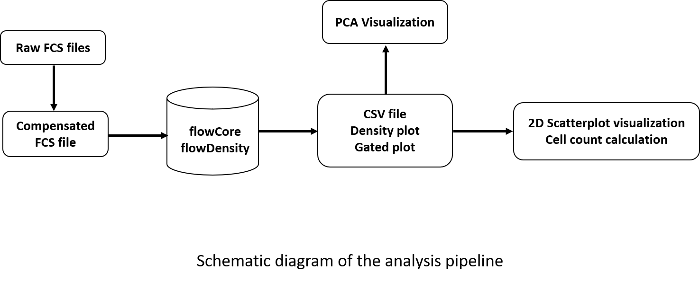

# Flow Cytometry Data Analysis and Visualization Pipeline using flowDensity
This repository consists of the pipeline scripts associated with the research paper “Implementing flowDensity for Automated Analysis of Bone Marrow Lymphocyte Population” by Eskandari et al.
The program analyzes flow cytometry data (.fcs) using flowDensity to automate analysis for evaluation of lymphocyte subsets in bone marrow biopsy specimens.

## Usage:
1. The main directory is divided into three groups - data, scripts, and result.
   Data directory contains fcs files for different cell types such as T cells, B cells, and CD34 cells.
   User needs to manually add flow cytometry data in .fcs format for each cell type in data/{cell type}.
   Result directory contains the output of the program in respective cell type folder.
    Sequential gating and PCA visualization outputs are present in result/{cell type}.
    Comprehensive expression analysis outputs are present in result/{cell type}/Independent/.
2. The pipeline consists of -
  step 1: run flowDensity with optimized parameters with parental gating
  step 2: run flowDensity with optimized parameters for comprehensive expression analysis
  step 3: PCA visualization
  step 4: Comprehensive expression analysis visualization

## Example
  bash runFlowDensityAnalysis.sh -t Tcells-Bcells-CD34cells
